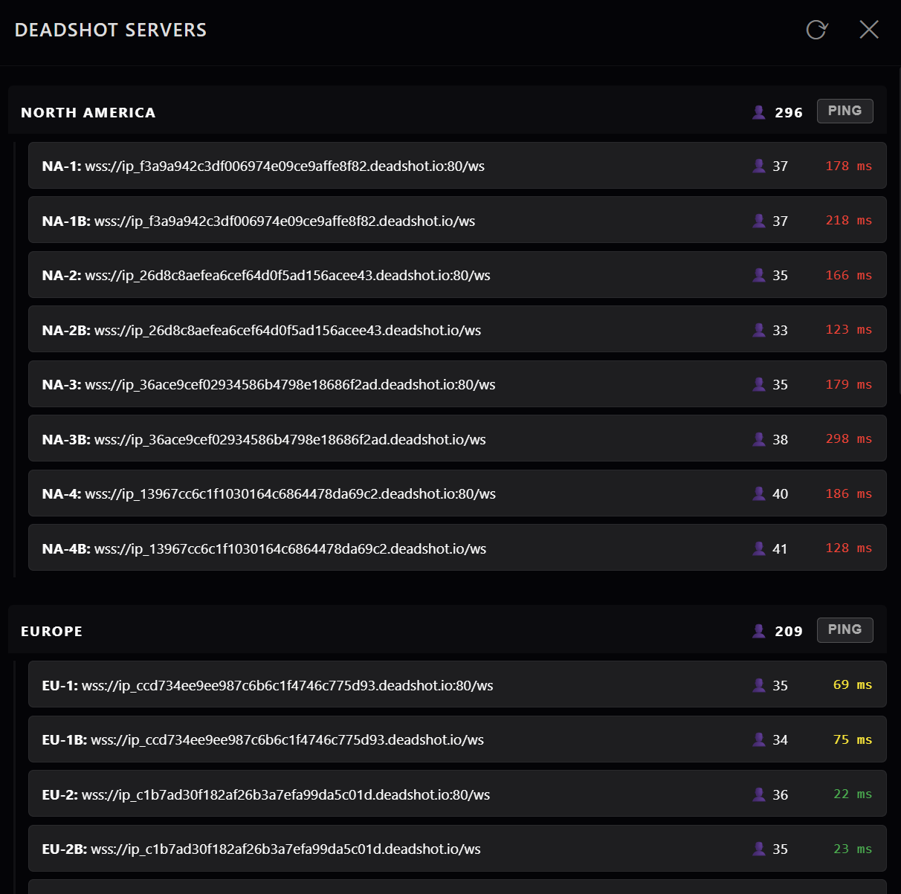

# Deadshot.io Server List

A standalone desktop application that displays the server list for the game [Deadshot.io](https://deadshot.io).



## Features

- **Server List:** View all available Deadshot.io servers and their addresses, grouped by region.
- **Ping calculation:** Calculate and refresh the ping latency for each game server via websocket.
- **Server problem check:** Verify if some servers are offline, by checking if the ping returns an error or if some servers do not appear.
- **User count:** Display the number of users on each server.

## Build from source

```bash
git clone https://github.com/doomer-0/deadshot-serverlist.git
cd deadshot-serverlist
npm install
npm start
```
